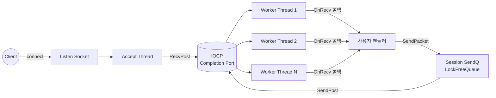

# NetworkLibrary

Windows IOCP 기반의 재사용 가능한 C++ 정적 네트워크 라이브러리. `NetServer` / `NetClient` 추상 클래스를 상속해 콜백 몇 개만 구현하면 IOCP·세션 관리·패킷 직렬화 코드를 직접 작성하지 않아도 서버·클라이언트를 만들 수 있다.

## Features

- **IOCP 기반** — Accept thread 1 + Worker thread N + Completion Port
- **TLS Chunk Memory Pool** — 스레드별 chunk(기본 100 slot) 풀링으로 atomic 경합을 chunk 단위까지 축소
- **LockFree 자료구조** — 47-bit pointer + 16-bit Tag union으로 ABA 회피한 Stack / Queue / MemoryPool
- **Zero-copy 친화 Packet** — 헤더 영역 20 byte 예약 + RecvBuffer를 Packet 클래스로 통일
- **IPacketEncoder Strategy** — 디폴트 XOR 자동 적용, 사용자 정의 암호화(AES 등) 인터페이스로 교체 가능
- **Catch2 v3 단위 테스트** — 28+ 테스트 (LockFree CAS / NetClient loopback / Packet 직렬화 / Logger overflow / CrashDump)

## Build

- Visual Studio 2026 (v145 toolset), MSVC
- `NetworkLibrary.sln` → `Debug|x64` 또는 `Release|x64`
- 외부 의존: `ws2_32.lib`, `winmm.lib`, `DbgHelp.lib`, `Pdh.lib` (모두 Windows SDK 기본 제공)
- Windows-only (Linux epoll 포팅은 Phase 4 예정)

## Quick Start — Server

```cpp
#include "NetServer.h"

class EchoServer : public NetServer {
public:
    bool OnConnectionRequest() override { return true; }
    void OnClientJoin(unsigned __int64 sessionID) override {}
    void OnClientLeave(unsigned __int64 sessionID) override {}

    void OnRecv(unsigned __int64 sessionID, Packet* packet) override {
        Packet* echo = AllocPacket();
        echo->PutData(packet->GetReadBufferPtr(), packet->GetDataSize());
        SendPacket(sessionID, echo);
        FreePacket(echo);
    }
};

int main() {
    EchoServer server;
    // serverIP=nullptr → 모든 인터페이스 / port=12001 / workerThreads=7 / nagle off / maxSession=16000
    server.Start(nullptr, 12001, 7, 0, FALSE, 16000);

    // ... 메인 루프 ...

    return 0;   // ~NetServer 소멸자가 Stop() 자동 호출 — 명시 호출 불필요
}
```

## Quick Start — Client

```cpp
#include "NetClient.h"

class EchoClient : public NetClient {
public:
    void OnConnect(unsigned __int64 sessionID) override {}
    void OnDisconnect(unsigned __int64 sessionID) override {}

    void OnRecv(unsigned __int64 sessionID, Packet* packet) override {
        // 응답 처리
    }
};

int main() {
    EchoClient client;
    client.Start(4, 0, 100);

    unsigned __int64 sid = client.Connect(L"127.0.0.1", 12001);
    if (sid == 0) return 1;

    Packet* p = client.AllocPacket();
    WORD type = 0x1001;
    int payload = 42;
    *p << type << payload;
    client.SendPacket(sid, p);
    client.FreePacket(p);

    // ... 메인 루프 ...

    return 0;   // ~NetClient 소멸자가 Stop() 자동 호출
}
```

## 암호화 적용

```cpp
// (a) 디폴트 — 인자 안 넘기면 NetServer/NetClient 내부가 XorPacketEncoder를 자체 생성·소유
EchoServer server;   // XOR 자동 적용

// (b) 사용자 정의 인코더 — IPacketEncoder 상속해서 NetServer/NetClient 생성자에 주입
class MyAesEncoder : public IPacketEncoder {
    // Encode / Decode / GetHeaderSize / VerifyHeaderMagic / PeekPayloadLength 5개 구현
};
MyAesEncoder myEncoder;
EchoServer secureServer(&myEncoder);
```

## Project Layout

```
NetworkLibrary/
├─ NetworkLibrary.sln
├─ BaseLibrary/             ← 범용 인프라 (Logger, CrashDump, LockFree·MemoryPool·MonitoringTool)
├─ NetworkLibrary/          ← 네트워크 코어 (NetServer, NetClient, Packet, IPacketEncoder)
├─ External/Catch2/         ← 단위 테스트 프레임워크 amalgamated
└─ Examples/
   ├─ TestServer/           ← echo 부하 측정 (NetServer 순수 throughput)
   ├─ TestClient/           ← 가변 부하 시나리오 (N개 동시 접속·Keep-Alive·Reconnect)
   ├─ ChatServer/           ← 재사용 예제 겸 회귀
   ├─ ChatDummyClient/      ← 옛 select 모델 비교용
   └─ NetworkLibraryTests/  ← Catch2 단위 테스트 (28+)
```

런타임 데이터 흐름:



## Status / Roadmap

- **Phase 1+2 완료** — 라이브러리 분리 + 결함 검토 (7건 모두 정통 IOCP 패턴 또는 디자인 의도)
- **Phase 3 진행 중** — Catch2 도입(3a) → BaseLibrary 분리(3b) → Google C++ Style 명명(3c) → 모더나이제이션(3d) `nullptr` 완료, `std::atomic` / `std::shared_mutex` / `std::thread` / `unique_ptr` 진행
- **Phase 4 예정** — CMake + Linux epoll 포팅
