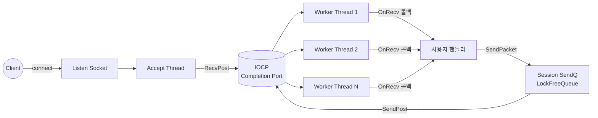
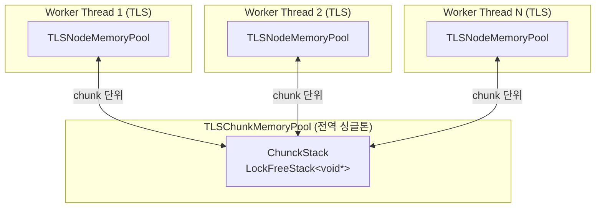
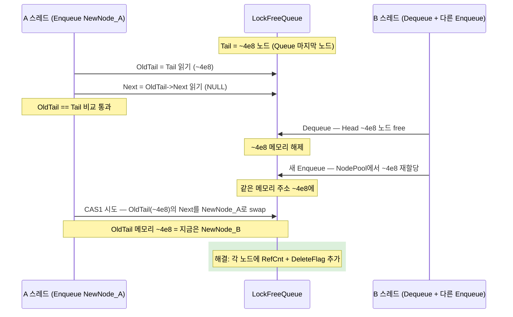

## 개요

이 프로젝트는 Windows IOCP(I/O Completion Port) 기반의 재사용 가능한 C++ 정적 라이브러리다. 다수 클라이언트 동시 접속을 처리하는 게임·채팅 서버를 구축할 때 매번 작성하던 IOCP 워커 스레드·세션 관리·패킷 직렬화 코드를 라이브러리로 분리하고, 그 위에 `NetServer` / `NetClient` 추상 클래스만 상속해 콜백 3~4개를 구현하면 즉시 서버·클라이언트를 만들 수 있는 형태로 제공한다.

라이브러리 내부는 비일반적 자료구조에 무게가 실려있다. lock-free 스택·큐, 47-bit user-space pointer + 1-bit Flag + 16-bit Tag로 ABA를 회피하는 union, 스레드별 chunk 단위로 메모리를 풀링해 atomic 경합을 최소화하는 TLS Chunk Memory Pool, 송신·수신·임시 버퍼·RecvBuffer를 같은 클래스로 통일해 buffer 변환·복사 비용을 없앤 zero-copy 친화 Packet, 그리고 사용자가 자체 암호화 방식을 채택할 수 있도록 인코더를 인터페이스로 분리한 Strategy 패턴이 핵심이다. 23년에 작성된 채팅 서버 코드에서 라이브러리 부분만 떼어내 정리하고 모던 C++로 단계적 컨버팅하는 중이며, 최종 목표는 Windows IOCP ↔ Linux epoll 크로스플랫폼 단일 라이브러리다.

## 시스템 아키텍처

세 개의 정적 라이브러리·실행 파일 레이어로 분리되어 있다.

- **BaseLibrary**: 네트워크에 의존하지 않는 범용 인프라. Logger, CrashDump, LockFreeStack, LockFreeQueue, LockFreeMemoryPool, TLSChunkMemoryPool / TLSNodeMemoryPool, MonitoringTool 포함. 다른 프로젝트에서도 그대로 가져다 쓸 수 있게 net 코드 0건.
- **NetworkLibrary**: BaseLibrary 위에서 동작하는 네트워크 코어. NetServer, NetClient, Packet, IPacketEncoder 인터페이스 + XorPacketEncoder 구현체.
- **Examples (라이브러리 활용 레이어)**: TestServer(echo 부하 측정), TestClient(가변 부하 시나리오), ChatServer(재사용 예제 겸 회귀), DummyClient(옛 select 모델 비교용), NetworkLibraryTests(Catch2 단위 테스트). 추후 게임 서버 등 다른 컨텐츠 추가 가능.

NetServer 한 인스턴스 내부는 Accept Thread 1개와 IOCP 워커 스레드 N개(기본 hardware concurrency)로 동작한다. Accept Thread는 listen 소켓에서 새 연결을 받아 LockFreeStack에서 빈 Session을 꺼내 IOCP에 RecvPost하고, 이후 모든 송수신은 워커 스레드에서 IOCP completion에 따라 처리된다. 패킷 객체는 워커 스레드별 TLS Chunk Memory Pool에서 alloc/free되어 스레드 간 경합 없이 풀링된다.



IOCP 자체는 Windows의 표준 비동기 I/O 모델이라 일반적인 설명은 생략한다. 위 다이어그램은 본 라이브러리의 핵심 흐름 — Accept 한 스레드가 새 연결을 IOCP에 RecvPost하고, 워커 스레드 N개가 completion을 받아 사용자 핸들러를 호출하며, 송신은 LockFreeQueue 기반 Session SendQ를 거쳐 다시 IOCP로 들어가는 구조를 보여준다.

## 사용 기술 / 라이브러리

- **언어**: C++14 (Phase 3d 모더나이제이션에서 C++17로 단계적 진화 중 — `nullptr`, `std::atomic`, `std::shared_mutex`, `std::thread`, `unique_ptr`)
- **빌드**: Visual Studio 2026 (v145 toolset), MSVC. Windows-only 현재. Phase 4에서 CMake + epoll Linux 포팅 예정
- **외부 의존**:
  - Winsock2 — IOCP, WSARecv/WSASend
  - winmm — 멀티미디어 타이머
  - DbgHelp — MiniDump
  - PDH — CPU·메모리·NIC 메트릭 수집
- **테스트**: Catch2 v3 amalgamated, 28+ 단위 테스트 (LockFree CAS, NetClient loopback, Packet 직렬화, Logger 64-bit overflow, CrashDump 회귀 등)

## 주요 설계 결정

### 1. TLS Chunk Memory Pool — 스레드별 chunk 풀링

고빈도 alloc/free 객체(Packet, Job 등)를 `new`/`delete` 매번 호출하지 않고 풀에서 재사용한다. 일반적인 lock-free pool은 매 alloc/free마다 lock-free CAS 한 번이지만, 본 라이브러리는 **chunk 단위(기본 100 slot)로 묶어 풀링**해서 스레드 간 atomic 경합을 chunk 단위까지 줄였다.



- **Tier 1 — TLSChunkMemoryPool** (전역 싱글톤): `LockFreeStack<void*>`에 빈 chunk(100 slot 묶음)를 보관. 스레드 간 공유.
- **Tier 2 — TLSNodeMemoryPool** (per-thread, TLS): 스레드별로 자기 chunk를 캐시한 채 slot 단위 alloc/free. `FreeNodeCnt`가 0이면 ChunckStack에서 새 chunk를 fetch, 100을 넘으면 chunk 단위로 ChunckStack에 반환.

결과적으로 per-packet alloc은 거의 모두 TLS 캐시 내 단일 pointer 조작으로 끝나고, 스레드 간 contention은 chunk 100개를 한 번에 옮길 때만 발생한다. cache locality도 자연스럽게 확보된다. 각 노드는 underflow/overflow padding(`0xdfdf...` / `0xefef...`)으로 메모리 손상을 즉시 감지한다.

### 2. LockFree 자료구조 + ABA 문제 추적·해결

LockFreeStack과 LockFreeQueue는 표준 CAS 기반 구현 위에 ABA 회피를 위한 비트 union을 추가했다.

```cpp
struct BitField {
    unsigned __int64 Index : 47;   // x86-64 user-space pointer
    unsigned __int64 Flag : 1;
    unsigned __int64 Tag : 16;     // ABA 회피용 sequence number
};
union stNode_TAGED {
    unsigned __int64 Data;
    BitField Bit;
    ...
};
```

x86-64 유저 영역 pointer가 47-bit를 넘지 않는다는 점을 활용해 상위 17-bit에 Flag(1)와 Tag(16)를 packed로 넣었다. CAS 시 Data 64-bit 전체를 한 번에 비교·교체하면 pointer와 Tag가 함께 검증된다. 실행 시점에 `GetSystemInfo`로 `lpMaximumApplicationAddress`가 `0x00007ffffffeffff`인지 확인해 47-bit 가정이 깨지지 않는지 검증한다.

**ABA 추적 경험 (프로젝트 작성자가 직접 재현·해결)**:

LockFreeQueue Enqueue는 2단 CAS를 사용한다.

1. CAS1: `Tail`의 `Next`에 새 노드 attach
2. CAS2: `Tail`을 새 노드로 advance

검증 과정에서 "Queue에 데이터가 분명히 있어야 하는 상황에서 Dequeue가 데이터 없음으로 실패"하는 현상을 만났다. 추적 결과 **클래식 ABA 패턴**이었다. 참조 카운터가 없는 가정에서 시나리오는 다음과 같다.

1. A 스레드 Enqueue: `OldTail = Tail` 읽기(~4e8), `Next = OldTail->Next` 읽기(NULL), `OldTail == Tail` 변화 검증 통과 후 CAS1 시도 직전에 컨텍스트 스위치
2. B 스레드: Head인 `~4e8` 노드를 Dequeue → 메모리 free
3. B 스레드: 다른 Enqueue 시 NodePool에서 `~4e8` 메모리를 재할당받음 → 새 의미의 NewNode_B로 초기화(`Next = nullptr`)
4. A 스레드 재진입: CAS1 시도 — `OldTail(~4e8)`의 `Next`가 `Next(NULL)`과 같으면 NewNode_A로 swap. 메모리 주소 `~4e8`은 그대로지만 그 노드는 이미 다른 의미의 NewNode_B. CAS1은 pointer 비교만 하므로 통과 → A는 의도한 옛 Tail이 아닌 NewNode_B에 attach → Queue 무결성 깨짐

디버깅 시 흔적: A의 CAS1 직후 CAS2 실패 상황과 Tail Tag(`1eb8` ↔ `1f12`)의 wrap을 통해 같은 메모리 주소가 다른 의미로 재사용된 정황을 포착.



**해결**: 각 노드에 `RefCnt`(참조 카운터)와 `DeleteFlag` 두 필드를 추가해 "참조 중인 노드는 free되지 않음"을 보장. A 스레드가 `OldTail = Tail` 직후 `OldTail->IncrementRef()`를 호출해 노드를 참조 중임을 표시 → B 스레드가 Dequeue 후 free 시도해도 RefCnt가 0이 될 때까지 실제 free를 지연 → `~4e8` 메모리가 A의 CAS1 시점까지 재할당되지 않음 → ABA race window 자체를 닫았다. 결과적으로 chunk-node 2-tier 디자인과 결합되어 Tag 16-bit wrap의 잠재적 한계까지 실질적으로 우회한다.

### 3. Packet 버퍼 + zero-copy 친화 + IPacketEncoder Strategy

Packet 클래스는 단순 버퍼지만 두 가지 설계 결정이 들어가 있다.

**(a) 헤더 영역 예약 (kHeaderDefault = 20 byte)**: `Clear()` 시 `Front`와 `Rear`가 모두 20에 위치해 payload는 offset 20부터 채워진다. 송신 직전 인코더가 앞쪽 20 byte 공간에 헤더(매직·길이·키·체크섬)를 채워 한 번에 전송한다. 일반적인 구현은 헤더와 페이로드를 별도 버퍼에 만들어 송신 시 합치거나 `memmove`로 헤더 공간을 만들어 prepend하는데, 본 설계는 처음부터 헤더 공간을 reserve해둠으로써 prepend 비용을 0으로 만든다.

**(b) RecvBuffer를 Packet 클래스로 통일**: 각 Session은 별도 RingBuffer 클래스 없이 `Packet RecvQ{4096}` 인스턴스 하나를 RecvBuffer로 사용한다. IOCP WSARecv가 Packet의 raw buffer에 직접 누적 write → `GetPacketMessage`로 완성된 메시지 추출 → 별도 변환·복사 0건. 이를 위해 Packet 기본 크기는 송신용 단일 패킷이 아닌 누적 가능한 buffer까지 커버하는 4096 byte로 설계됐다. 송신·수신·임시 버퍼·RecvBuffer까지 모두 같은 Packet 클래스라 라이브러리 사용자는 한 가지 API만 익히면 된다.

**IPacketEncoder Strategy 패턴**: 송신 시 헤더 부착·암호화, 수신 시 복호화·검증을 인터페이스로 분리. 라이브러리 디폴트는 `XorPacketEncoder` (5 byte 헤더 + per-packet random key XOR — 약식 obfuscation 수준). 라이브러리 사용자가 정규 암호화(AES, ChaCha20 등)를 원하면 `IPacketEncoder`를 상속한 자체 인코더를 작성해 NetServer/NetClient 생성자에 주입하면 된다. 라이브러리 코드 한 줄도 안 바꾸고 암호화 방식을 교체할 수 있는 의존성 주입 구조.

### 4. 정통 IOCP 가드 패턴

세션 수명 관리에 `InterlockedCompareExchange128`을 사용해 RefCnt(64-bit) + SessionID(64-bit) 128-bit를 한 번에 atomic 가드한다. DisconnectSession 중복 호출, Accept 직후 즉시 종료 race 등 다섯 가지 race scenario를 분석한 결과 모든 진입로에서 가드가 일관되게 작동함을 확인했다. SendPost 동시 발행은 `InterlockedExchange(&SendFlag, 1)` test-and-set 패턴으로 한 시점에 한 스레드만 SendPost를 발행하도록 직렬화하고, 0으로 해제할 때는 일반 store로 처리한다.

### 5. 모더나이제이션 진행 (Phase 3d)

C++14 → C++17 전환이 진행 중이다. `NULL` → `nullptr`(완료), Windows `Interlocked*` → `std::atomic<T>`, `SRWLock` → `std::shared_mutex`, `_beginthreadex` → `std::thread`, raw `new`/`delete` → `unique_ptr`(hot path에서는 `shared_ptr` 회피)이 순서대로 진행 중이다. 단순 표현 변경이지만 핫패스(per-packet, per-connection) 영역에서는 memory_order 정밀 지정과 baseline TPS 측정 후 ±10% 회귀 검증을 모든 sub-step에서 적용한다.

## 주요 기능 (라이브러리 사용자/개발자 시점)

- `NetServer` 상속 후 `OnConnectionRequest` / `OnClientJoin` / `OnClientLeave` / `OnRecv` 콜백 4개 구현으로 서버 즉시 구축
- `NetClient` 상속 후 `OnConnect` / `OnDisconnect` / `OnRecv` 콜백 3개 구현으로 클라이언트 즉시 구축
- `Packet::operator<<` / `operator>>` 로 type-safe 직렬화 — `BYTE` ~ `__int64`, `WCHAR*`까지 지원
- `IPacketEncoder` 인터페이스 구현으로 사용자 정의 암호화 적용 가능 (NetServer/NetClient 생성자에 주입)
- `TLSChunkMemoryPool<T>` 으로 고빈도 alloc 객체(Packet, Job 등) 자동 풀링
- `LockFreeStack<T>` / `LockFreeQueue<T>` 으로 worker thread 간 producer-consumer 큐 직접 구축 가능
- MonitoringTool로 RecvTPS / SendTPS / CPU% / Memory / NIC 메트릭 자동 출력 (TestServer에 통합)

콘솔 출력 스크린샷은 추후 추가 예정.

## 흥미로운 패턴 / 한계

- **47-bit pointer + Tag union**: x86-64 user-space 메모리 영역(0~0x00007fffffffffff) 안에서만 동작하는 가정. 실행 시점에 `GetSystemInfo`로 `lpMaximumApplicationAddress` 검증해 가정이 깨지면 즉시 detect (LockFreeQueue.h, LockFreeStack.h, LockFreeMemoryPool.h).
- **Phase 1+2 결함 검토 의심 7건이 모두 결함 아니었음**: GetQueuedCompletionStatus 에러 분기, volatile 누락, RefCnt 경합, SendPost 직렬화, Logger 락 부재, MemoryPool 회수, LockFreeQueue Tag wrap — 코드 정독·호출 그래프·race scenario 분석으로 모두 정통 IOCP 패턴 또는 디자인 의도였음이 확인됐다.
- **한계**: Windows-only — Phase 4에서 epoll Linux 포팅 예정. 모니터링은 콘솔 출력 형태로 대시보드 UI 없음.
